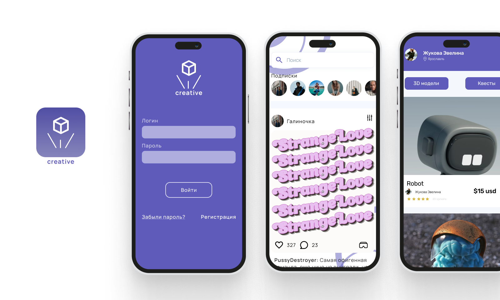

  

# Creative
🟣 The "Creative" application is a tool designed to provide 3D artists with the ability to view and work on their digital creations in the real world using AR technology.

🟣 This application allows artists to easily exhibit their work to potential clients and audiences in a way that is interactive and engaging.

🟣 With "Creative," 3D artists can explore their work from different angles and perspectives, gaining a more comprehensive understanding of their creations.

🟣 The application's AR capabilities provide artists with an immersive experience that allows them to interact with their digital models in a way that is intuitive and natural.

🟣 "Creative" is designed to be user-friendly, with an intuitive interface that makes it easy for artists to showcase their work and collaborate with others in real-time.

🟣 Ultimately, "Creative" is a powerful tool for 3D artists that leverages the latest AR technology to bring their creations to life in the real world, providing a unique and compelling way to experience digital art.

## Exploitation
🧷 Android  - [APK](https://drive.google.com/file/d/1syseiS53U3DsJx9CcD5gJXQvTmH32tgd/view?usp=sharing) 
🧷 IOS  - ask [@tw0ch](https://t.me/tw0ch) for TestFlight

## Application Development

- *Egor Mizyulin* - Mobile dev [@tw0ch](https://t.me/tw0ch)
- *Mike Nedviga* - Backend dev [@nondescr1pt](https://t.me/nondescr1pt)
- *Tatiana Bobyleva* - Design [@tattumm](https://t.me/tattumm)
- *Maxim Zhukov* - Design [@By_od1](https://t.me/by_od1)
- *Daniil Orlov* - Product/Project manager [@MrOrlov_1](https://t.me/MrOrlov_1)
